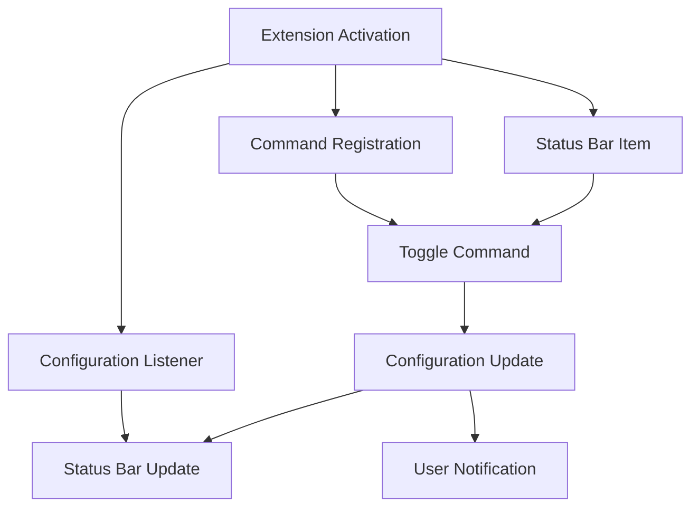

# Developer Guide

This guide provides comprehensive information for developers working on the Markdown Auto Preview Toggle extension.

## 🎯 Architecture Overview

### Core Components



### Data Flow
1. **Activation**: Extension loads and initializes components
2. **User Action**: Clicks status bar or runs command
3. **State Check**: Read current `workbench.editorAssociations` setting
4. **Toggle Logic**: Add/remove `*.md` association
5. **Update**: Write new configuration and update UI
6. **Feedback**: Show notification and update status bar

## 🔧 Technical Implementation

### Extension Entry Point
```typescript
// src/extension.ts
export function activate(context: vscode.ExtensionContext) {
    // 1. Create status bar item
    // 2. Register toggle command
    // 3. Set up configuration listener
    // 4. Add subscriptions for cleanup
}
```

### Configuration Management
The extension manipulates VS Code's `workbench.editorAssociations` setting:

**Enabled State:**
```json
{
  "workbench.editorAssociations": {
    "*.md": "vscode.markdown.preview.editor"
  }
}
```

**Disabled State:**
```json
{
  "workbench.editorAssociations": {
    // *.md association removed
  }
}
```

### Status Bar Integration
- **Alignment**: `StatusBarAlignment.Right` with priority 100
- **Icons**: Uses VS Code's built-in icons (`eye` and `eye-closed`)
- **Background**: Highlighted when auto-preview is enabled
- **Tooltip**: Descriptive text for accessibility

## 🧪 Testing Strategy

### Test Coverage Areas
1. **Core Functionality**
   - Command registration
   - Toggle behavior
   - Configuration handling

2. **Edge Cases**
   - Empty configuration
   - Large configuration objects
   - Rapid toggling
   - Concurrent execution

3. **Performance**
   - Activation time
   - Memory usage
   - Command execution speed

4. **Integration**
   - VS Code API compatibility
   - Status bar functionality
   - Configuration persistence

### Running Tests
```bash
# Run all tests
npm test

# Watch mode for development
npm run watch-tests

# Compile tests only
npm run compile-tests
```

### Test Environment
- Uses VS Code's test framework
- Runs in headless VS Code instance
- Isolated configuration scope
- Automatic cleanup after tests

## 🚀 Build Process

### Development Build
```bash
npm run compile
# - TypeScript compilation
# - ESLint checking
# - esbuild bundling
```

### Production Build
```bash
npm run package
# - All development steps
# - Minification
# - Source map generation
# - Bundle optimization
```

### Watch Mode
```bash
npm run watch
# - Continuous TypeScript checking
# - Automatic esbuild rebuilding
# - Live reload in Extension Development Host
```

## 📦 Packaging and Distribution

### VSIX Package Creation
```bash
# Install vsce globally
npm install -g vsce

# Create VSIX package
vsce package

# Output: markdown-auto-preview-toggle-0.0.1.vsix
```

### Marketplace Publishing
```bash
# Login to Azure DevOps
vsce login <publisher>

# Publish to marketplace
vsce publish

# Publish specific version
vsce publish 1.0.0
```

### GitHub Releases
1. **Tag version**: `git tag v1.0.0`
2. **Push tags**: `git push origin --tags`
3. **Create release** on GitHub with:
   - Release notes from CHANGELOG.md
   - VSIX file attachment
   - Installation instructions

## 🔍 Debugging Guide

### Extension Development Host
1. **Start debugging**: Press `F5` in VS Code
2. **Set breakpoints** in TypeScript source
3. **Use developer console** in Extension Development Host
4. **Check logs** in original VS Code instance

### Common Issues
- **Extension not loading**: Check package.json activation events
- **Command not found**: Verify command registration in contributes
- **Configuration not updating**: Check ConfigurationTarget scope
- **Status bar not visible**: Ensure statusBarItem.show() is called

### Logging Strategy
```typescript
// Development logging
console.log('Extension activated');

// User-facing messages
vscode.window.showInformationMessage('Success');
vscode.window.showErrorMessage('Error occurred');

// Output channel for detailed logs
const outputChannel = vscode.window.createOutputChannel('MD Toggle');
outputChannel.appendLine('Detailed log message');
```

## 🔒 Security Considerations

### Configuration Scope
- Uses `ConfigurationTarget.Global` for user-wide settings
- No workspace-specific overrides to prevent conflicts
- Read-only access to other configuration sections

### Data Handling
- No external network requests
- No file system access outside VS Code API
- No sensitive data storage
- Minimal memory footprint

### Permissions
Extension requires only:
- Configuration read/write access
- Command registration
- Status bar item creation

## 🚦 Performance Guidelines

### Activation Time
- **Target**: <100ms activation time
- **Strategy**: Minimal initialization work
- **Monitoring**: Performance tests in CI/CD

### Memory Usage
- **Target**: <5MB heap increase during normal operation
- **Strategy**: Proper disposal of subscriptions
- **Monitoring**: Memory tests with repeated operations

### Bundle Size
- **Target**: <50KB compressed bundle
- **Strategy**: ESBuild tree shaking and minification
- **Monitoring**: Bundle analysis in build process

## 🔄 Continuous Integration

### GitHub Actions Workflow
```yaml
# .github/workflows/ci.yml
name: CI
on: [push, pull_request]
jobs:
  test:
    runs-on: ubuntu-latest
    steps:
      - uses: actions/checkout@v3
      - uses: actions/setup-node@v3
      - run: npm ci
      - run: npm test
      - run: npm run package
```

### Quality Gates
- ✅ All tests pass
- ✅ No linting errors
- ✅ Successful build
- ✅ Bundle size within limits
- ✅ Performance benchmarks met

## 📊 Monitoring and Analytics

### Extension Usage
- Track through VS Code marketplace statistics
- Monitor download trends
- Review user feedback and ratings

### Error Tracking
- VS Code extension host error logs
- User-reported issues on GitHub
- Automated test failure notifications

### Performance Metrics
- Activation time across different VS Code versions
- Memory usage patterns
- Command execution frequency

## 🔧 Maintenance Tasks

### Regular Maintenance
- **Dependencies**: Update monthly, check for security advisories
- **VS Code API**: Test with new VS Code releases
- **Documentation**: Keep README and guides current
- **Tests**: Add tests for new edge cases discovered

### Release Checklist
- [ ] Version number updated
- [ ] Changelog updated
- [ ] All tests passing
- [ ] Manual testing completed
- [ ] Documentation reviewed
- [ ] Performance benchmarks met
- [ ] Security review completed

This developer guide should be updated as the extension evolves and new development patterns emerge.
