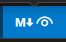
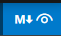
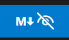
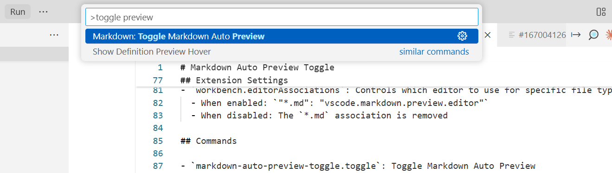

![VS Code Markdown Auto Preview Toggle Banner](data:image/svg+xml;base64,PHN2ZyB3aWR0aD0iODAwIiBoZWlnaHQ9IjEwMCIgeG1sbnM9Imh0dHA6Ly93d3cudzMub3JnLzIwMDAvc3ZnIj4KICA8ZGVmcz4KICAgIAogICAgPHBhdHRlcm4gaWQ9InBhdHRlcm4iIHg9IjAiIHk9IjAiIHdpZHRoPSIyOCIgaGVpZ2h0PSIyNCIgcGF0dGVyblVuaXRzPSJ1c2VyU3BhY2VPblVzZSI+CiAgICAgIDxyZWN0IHdpZHRoPSIyOCIgaGVpZ2h0PSIyNCIgZmlsbD0iIzA2NWY0NiIvPgogICAgICA8cG9seWdvbiBwb2ludHM9IjE0LDIgMjQsOCAyNCwxNiAxNCwyMiA0LDE2IDQsOCIgZmlsbD0ibm9uZSIgc3Ryb2tlPSIjMzRkMzk5IiBzdHJva2Utd2lkdGg9IjEiIG9wYWNpdHk9IjAuMiIvPgogICAgPC9wYXR0ZXJuPgogIDwvZGVmcz4KICA8cmVjdCB3aWR0aD0iODAwIiBoZWlnaHQ9IjEwMCIgZmlsbD0idXJsKCNwYXR0ZXJuKSIvPgogIDx0ZXh0IHg9IjQwMCIgeT0iMzUiIGZvbnQtZmFtaWx5PSJBcmlhbCBCbGFjayIgZm9udC1zaXplPSIyNCIgZmlsbD0id2hpdGUiIHRleHQtYW5jaG9yPSJtaWRkbGUiPlZTIENvZGUgTWFya2Rvd24gQXV0byBQcmV2aWV3IFRvZ2dsZTwvdGV4dD4KICA8dGV4dCB4PSI0MDAiIHk9IjU1IiBmb250LWZhbWlseT0iQXJpYWwiIGZvbnQtc2l6ZT0iMTQiIGZpbGw9IiMzNGQzOTkiIHRleHQtYW5jaG9yPSJtaWRkbGUiPlRvZ2dsZSBtYXJrZG93biBwcmV2aWV3IG1vZGUgd2l0aCBhIHNpbmdsZSBjbGljazwvdGV4dD4KICA8dGV4dCB4PSI0MDAiIHk9Ijc1IiBmb250LWZhbWlseT0iQXJpYWwiIGZvbnQtc2l6ZT0iMTIiIGZpbGw9InJnYmEoMjU1LDI1NSwyNTUsMC43KSIgdGV4dC1hbmNob3I9Im1pZGRsZSI+4pqZ77iPIFByb2Zlc3Npb25hbCBWUyBDb2RlIEV4dGVuc2lvbjwvdGV4dD4KPC9zdmc+)


# Markdown Auto Preview Toggle  

> One-click markdown preview toggle. Zero configuration required. Save time with instant status bar access to markdown view modes.. See source code [here](https://github.com/GSejas/vscode-review-md-toggle)

[](https://marketplace.visualstudio.com/items?itemName=GSejas.markdown-auto-preview-toggle)

<!-- 🎬 Demo GIF -->

> *Quick demo showing the toggle functionality in action*

## Features

- **Status Bar Toggle**: A convenient button in the status bar to quickly toggle markdown auto-preview
- **Visual Indicator**: The button shows different icons and colors based on the current state:
  - 👁️ (eye) with highlighted background when auto-preview is enabled
  - 👁️‍🗨️ (eye-closed) when auto-preview is disabled
- **Global Setting**: Changes are applied globally using VS Code's `workbench.editorAssociations` setting
- **Automatic State Detection**: The extension detects the current state on startup and updates accordingly


<!-- 📸 Visual State Comparison -->
<table>
<tr>
<td align="center">
<strong>Auto-Preview Enabled</strong><br>

</td>
<td align="center">
<strong>Auto-Preview Disabled</strong><br>

</td>
</tr>
</table>

## How It Works

The extension toggles the `workbench.editorAssociations` setting for `*.md` files between:
- **Enabled**: `"*.md": "vscode.markdown.preview.editor"` - Markdown files open in preview mode by default
- **Disabled**: No association (removed) - Markdown files open in the editor normally

## Usage

<!-- 🎥 Installation GIF Placeholder -->
### Installation

**Direct Link**
[](https://marketplace.visualstudio.com/items?itemName=GSejas.markdown-auto-preview-toggle)

<!--  -->

### Quick Start
1. Look for the eye icon in the status bar (bottom right)
2. Click the button to toggle between auto-preview enabled/disabled
3. The icon and background will update to reflect the current state
4. [Optional] If configured (see `markdownAutoPreviewToggle.showNotifications`), a notification will confirm the change

<!-- 📷 Command Palette Usage -->
### Alternative: Command Palette


You can also use the command palette (`Ctrl+Shift+P` / `Cmd+Shift+P`) and search for "Toggle Markdown Auto Preview".

## Development

To run and test this extension:

1. Open this folder in VS Code
2. Press `F5` to open a new Extension Development Host window
3. In the new window, look for the eye icon in the status bar
4. Open the included `test-markdown.md` file to test the functionality

## Extension Settings

This extension contributes the following settings:

- `markdownAutoPreviewToggle.showNotifications`: 
  - **Type**: `boolean`
  - **Default**: `false`
  - **Description**: Show notification messages when toggling markdown auto-preview mode
  - **Usage**: Enable this if you want visual feedback when toggling (disabled by default for a silent experience)

This extension also modifies the following VS Code setting:

- `workbench.editorAssociations`: Controls which editor to use for specific file types
  - When enabled: `"*.md": "vscode.markdown.preview.editor"`
  - When disabled: The `*.md` association is removed

### Configuring Notifications

By default, the extension operates silently. To enable notifications:

1. Open VS Code Settings (`Ctrl+,` / `Cmd+,`)
2. Search for "markdown auto preview toggle"
3. Check the "Show Notifications" option
4. Or add to your `settings.json`:
   ```json
   {
     "markdownAutoPreviewToggle.showNotifications": true
   }
   ```

## Commands

- `markdown-auto-preview-toggle.toggle`: Toggle Markdown Auto Preview

## Troubleshooting:

1. Why do I click and it doesn't update the preview
> Verify that the settings.json for the workspace doesn't contain the following settings:

```json
{
     "workbench.editorAssociations": {
    "*.md": "vscode.markdown.preview.editor"
  },
}
```

If present, delete them.

## Release Notes

### 1.0.5 - Latest
- 🔕 **Silent by default**: Notifications are now disabled by default for a cleaner experience
- ⚙️ **Configurable notifications**: Users can enable notifications in VS Code settings if desired
- 🎛️ **New setting**: `markdownAutoPreviewToggle.showNotifications` for controlling notification behavior

* See [CHANGELOG](./CHANGELOG.md) for complete version history

---

## Following extension guidelines

Ensure that you've read through the extensions guidelines and follow the best practices for creating your extension.

* [Extension Guidelines](https://code.visualstudio.com/api/references/extension-guidelines)

## Working with Markdown

You can author your README using Visual Studio Code. Here are some useful editor keyboard shortcuts:

* Split the editor (`Cmd+\` on macOS or `Ctrl+\` on Windows and Linux).
* Toggle preview (`Shift+Cmd+V` on macOS or `Shift+Ctrl+V` on Windows and Linux).
* Press `Ctrl+Space` (Windows, Linux, macOS) to see a list of Markdown snippets.

## For more information

* [Visual Studio Code's Markdown Support](http://code.visualstudio.com/docs/languages/markdown)
* [Markdown Syntax Reference](https://help.github.com/articles/markdown-basics/)

**Enjoy!**
